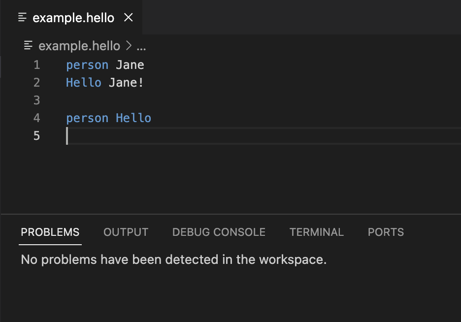
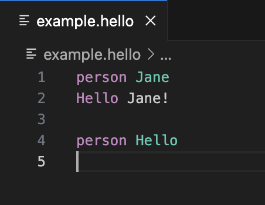

Langium treats keywords like `var`, `const` or `function` as keyword tokens, even at unintended locations according to your grammar.
Additionally, these strings are always highlighted as _keyword_ (in blue in this guide, while other text is white) whenever they are used.
Summarizing, these keywords cannot be used as values for names, identifiers or other properties by default and need to be explicitly enabled.
This guide explains how to do that.

Let's look at the "hello-world" example in the [playground](https://langium.org/playground?grammar=OYJwhgthYgBAEgUwDbIPYHU0mQEwFD6IB2ALiAJ6wCyauKAXPrC7ABQAOiIAzmsTwDUAXgAK3PsVgAfWKESJSAS2LAhwgOIgFy1QEoAVAG5C43vyatYAci7ni12MUiJhASQAiJ-Fp0rglqzWSKhojnaSwgDaZpIMngC6NgCE1t4AFkq49FKk3BAqYMiwGADKDLAA9AA6QpUmeSAFzsWeFZVRAPpgALQAXgCCPQBaCVHVAO6dCQb1hJnZJLCNzUU0ADKdAMIA8tTUAKIAcgAq7dU1BuM81aUzAPzVBhdzCznL%2BYXFpZu7%2B8dnKoXC5RAB61WI1RAMzmQA&content=A4UwTgzg9gdgBAKQIYxAKABIgDbaolEAQjTVElji1yjSA) or as a new local project created with `yo langium` (for details, how to set up your first Langium project, read [getting started](/docs/getting-started/)):


Here, it is not possible to introduce a person whose name is "Hello", since `Hello` is a dedicated keyword of the language. Additionally, we cannot greet a person called "Hello" as well.
The same applies to the keyword "person", but let's focus on enabling "Hello" as name for persons.

To enable keywords as identifiers, you need to apply the following three steps:





## Step 1: Modify the grammar to explicitly parse keywords as property values

The __first step__ is to modify the grammar to explicitly parse keywords as property values:
At the moment, the parser rule for introducing persons looks like this:

```langium
Person: 'person' name=ID;
terminal ID: /[_a-zA-Z][\w_]*/;
```

Note that the terminal rule for `ID` already covers the string "Hello",
but since the parser rule for greeting persons uses "Hello" as keyword, the keyword takes precedence:

```langium
Greeting: 'Hello' person=[Person:ID] '!';
```

Roughly summarized, the background for this behaviour is, that Langium's internally used LL(k) parser implementation named [Chevrotain](https://chevrotain.io) first does _lexing_/tokenizing, i.e. splitting text into single tokens, e.g. words separated by white space.
The actual _parsing_, i.e. the application of the parser rules, is performed afterwards on these tokens.
Chevrotain uses regular expressions (regex) for splitting text into tokens.
Since keywords are implemented as regex as well and take precedence, _all_ occurrences of "Hello" are treated as keywords for the parser rule for greetings,
even "Hello" which are intented to be names, which finally causes the two errors in the "Problems" tab above.

In order to explicitly enable parsing "Hello" as name as well, modify the parser rule for persons in this way:

```langium
Person: 'person' name=(ID | 'Hello');
terminal ID: /[_a-zA-Z][\w_]*/; // the terminal rule for ID is unchanged!
```

Now Langium knows, that keyword "Hello" may also occur as value for the `name` property of the parser rule for persons.
That's it! (Don't forget to run `npm run langium:generate` after updating the grammar.)



Since the `name` property is used for cross-references by the parser rule for greetings, "Hello" needs to be supported here as well. For that we recommend to introduce a [data type rule](/docs/grammar-language/#data-type-rules) like "PersonID" in the example, since it makes it easier to support more keywords in the future:

```langium
Person: 'person' name=PersonID;

Greeting: 'Hello' person=[Person:PersonID] '!';

PersonID returns string: ID | 'Hello';
```

Now, your editor accepts "Hello" as value for person's names.
Nevertheless, the name "Hello" still is highlighted in blue and looks like a keyword "Hello". This leads us to the second step.


## Step 2: Change the semantic type of the resulting token

The __second step__ is to change the semantic type of the resulting token in order to adjust the highlighting in the editor:
While parsing text with Langium is done in a language server, the highlighting is done in editors (the language clients).
Editors like VS Code usually use _syntax highlighting_ basing on the tokenized text. This highlighting can be complemented by _semantic highlighting_ with additional semantic types for the tokens from the language server.

In case of Langium and VS Code, VS Code uses by default TextMate grammars, which can be seen as collections of regex (and which is generated by `npm run langium:generate`), to split the text into tokens and to assign a (syntactic) type to these tokens. The color for highlighting the token is chosen depending on the assigned type.
In the example, a regex for the "Hello" keyword matches _all_ strings "Hello" in text, resulting in the blue color even for "Hello" used as name.

Since Langium applies the parser rules to the token stream, Langium is able to distinguish "Hello" tokens used as keyword for greetings and "Hello" tokens used as name for persons and therefore is able to assign different _semantic_ types to "Hello" tokens for persons and for greetings.
According to the Language Server Protocol (LSP), these semantic token types are sent to editors like VS Code, which complement the syntactic types of tokens with these semantic types.
The default highlighting of tokens according to the syntactic type is then altered according to the semantic token type and the color theme selected by the user (editor preferences).

In Langium, the `SemanticTokenProvider` service is responsible for assigning language-dependent semantic types to tokens.
Therefore, we customize the default semantic token provider like this:

```ts
import { AbstractSemanticTokenProvider, AstNode, SemanticTokenAcceptor } from "langium";
import { isPerson } from "./generated/ast.js";
import { SemanticTokenTypes } from 'vscode-languageserver';

export class HelloWorldSemanticTokenProvider extends AbstractSemanticTokenProvider {
    protected override highlightElement(node: AstNode, acceptor: SemanticTokenAcceptor): void | "prune" | undefined {
        if (isPerson(node)) {
            acceptor({
                node,
                property: 'name',
                type: SemanticTokenTypes.class
            });
        }
    }
}
```

For all persons (`isPerson(...)` in line 7), we explicitly specify the semantic type for the token of their `'name'` property.
Here, we use `SemanticTokenTypes.class` as semantic type.
For your case, select a predefined type which fits your domain best.
Since the name is used as cross-reference by greetings, a similar check and assignment of a semantic token type needs to be done for the `person` property of `Greeting` as well.

After creating the semantic token provider, you need to register the `HelloWorldSemanticTokenProvider` in `hello-world-module.ts` in the following way:

```ts
export const HelloWorldModule: Module<HelloWorldServices, PartialLangiumServices & HelloWorldAddedServices> = {
    lsp: {
        SemanticTokenProvider: (services) => new HelloWorldSemanticTokenProvider(services)
    },
    validation: {
        HelloWorldValidator: () => new HelloWorldValidator()
    }
};
```

Now rebuild and restart your application and test the improvements of the second step:


The `HelloWorldSemanticTokenProvider` works, and you might see a different highlighting XOR you might not see any difference, e.g. "Hello" is still blue here. This leads us to the third step.


## Step 3: Ensure that your editor styles the chosen semantic token type

The __third step__ is to ensure, that your editor supports the assigned semantic tokens:
Depending on your editor and the currently selected color theme, the semantic token type selected in `HelloWorldSemanticTokenProvider` might not be supported or didn't got a different color in the color theme.
The easiest way to detect such problems is to change the current color theme and to try some others.
Note, that VS Code allows to switch off semantic highlighting for all themes with the setting `editor.semanticHighlighting.enabled`.

After switching from "Dark (Visual Studio)" to "Dark Modern" in VS Code, the example looks as expected.
You can switch the current color theme in VS Code with `cmd + K` `cmd + T` (or via the menu: Code -> Settings... -> Theme -> Color Theme).



Now "Hello" is highlighted in purple if used as keyword, it's written in green if it is used as value for the name of a person.
Another solution is to select a different semantic type for your token in step two.

While __step one__ is mandatory to enable keywords as values in general,
__step two__ improves the user experience of your language.
While step one and step two can be handled in the LSP server once for your language, __step three__ highly depends on your editor and its color themes (in the LSP clients), which makes step three quite complicated to handle.


Now you have learned, how to technically enable keywords as regular values for properties.
Feel free to enable the keyword "person" as name for persons in the example on your own.

Word to the wise: Enabling certain strings to be used interchangeably as keywords and identifiers/values is possible, but has some costs. It always needs to be evaluated per case, whether accepting the costs is required and worth it.
Additionally, using keywords as identifiers impacts the user experience, therefore, involve the users of your language!

Some hints beyond this guide:

- In [multi-grammar projects](/guides/multiple-languages), only keywords of the included grammars are affected by this general problem, but not keywords of other languages or Langium grammar files.
- In order to get an overview about the keywords of your language, have a look into the generated TextMate grammar `*.tmLanguage.json` and search for the pattern named `keyword.control.*`, which contains a regex with the keywords.
- Read about the concept of semantic tokens in the [Language Server Protocol](https://microsoft.github.io/language-server-protocol/specifications/lsp/3.17/specification/#textDocument_semanticTokens) (LSP) including predefined semantic types for tokens.
- Read about how [VS Code](https://code.visualstudio.com/api/language-extensions/semantic-highlight-guide) realizes semantic highlighting using semantic tokens.
- Dive into [tokenizing of Chevrotain](https://chevrotain.io/docs/features/token_alternative_matches.html) with regex.
