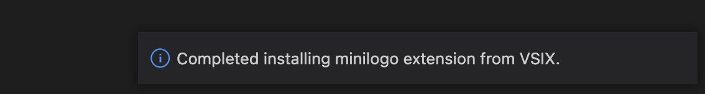



In this tutorial we'll be going over how to build a VSIX extension (VSCode extension) for your Langium-based language. This will allow providing LSP support in VSCode for your language. We'll assume that you've already looked at the previous tutorial, and have had time to read the [guide on bundling](/guides/code-bundling/), so that you're ready to build an extension. At this point we assume that your language is also working, and there are no issues running `npm run langium:generate` or `npm run build`. If there are, you'll want to correct those first.

## Setting up the Scripts

To get started, you'll want to have a language expressed in Langium, such as [Lox](https://github.com/langium/langium-lox) or [MiniLogo](https://github.com/langium/langium-minilogo). If you have been following along with these tutorials, you should already have something ready. If you don't you can also use the default language generated by the yeoman generator for Langium, presented in the [getting started](/docs/getting-started/) section.

Regardless of what you're working with, you'll want to make sure you have the following scripts in your **package.json**.

```json
{
    ...
    "vscode:prepublish": "npm run esbuild-base -- --minify && npm run lint",
    "esbuild-base": "esbuild ./src/extension.ts --bundle --outfile=out/main.js --external:vscode --format=cjs --platform=node",
    ...
}
```

The `esbuild-base` script is particularly important, as it will be constructing the extension itself.

You'll also need to install `esbuild` if you haven't already.

```bash
npm i --save-dev esbuild
```

## Generate an Extension

At this point we're ready to generate an extension. We need the VS Code Extension Manager (`vsce`) to do this, so make sure to download this from npm via `npm install -g vsce` (or install locally, as per your preference). Once you have that installed, you can invoke it like so from the root of your project.

```bash
vsce package
```

You should now see a VSIX extension file in the root of your project. The name of this file will correspond with the **name** and **version** properties listed in your **package.json**. For MiniLogo, this produced **minilogo-0.1.0.vsix**.



## Installing

For installing the extension, you can right click the extension file, and select "Install VSIX Extension" at the bottom of the list.



You should see a small indication at the bottom right of your screen that your VSIX extension has been successfully installed, like so:



You can verify this by going to your extensions tab and looking at the enabled extensions, where you should find the name of your language (again corresponding to the **name** property in your package.json).



Assuming the extension is enabled and working correctly, you can open any file that ends in the extensions registered for your language, and you should immediately observe the syntax highlighting kicking in. Interaction with your language should show that syntax errors are recognized, and other LSP functionalities are working as intended (such as renaming of symbols).

## Adding an Icon

You may notice that your extension may not have an icon to start with. This is a small thing that we can quickly fix. This is as simple as adding a small PNG icon somewhere in your project repo, such as the root. You'll also want to set the **icon** property in your package.json with the relative path to this icon.

```json
{
    ...
    "name": "minilogo",
    "displayName": "minilogo",
    "icon": "icon.png",
    "publisher": "TypeFox",
    ...
}
```

In our example, we're using a simple turtle icon from [onlinewebfonts](https://www.onlinewebfonts.com/icon/74548) as a placeholder.



When you regenerate your extension & reinstall it, you should get an icon that is the same as the one that you packaged it with.



## Conclusion

And that's it, at this point you have an extension for your language that you can use for development. After some testing, and improvements, you could even publish it!

As a quick aside, it's important to keep the extensions that your language recognizes synchronized in both your **package.json** and your **langium-config.json**. If you do make changes to your extensions, it's a good idea to double check that these are both synced up, and to do a full rebuild to get those changes into your extension.

And that's it for building an extension. In the next tutorial, we'll be setting up [Langium + Monaco in the web](/tutorials/langium_and_monaco/).
